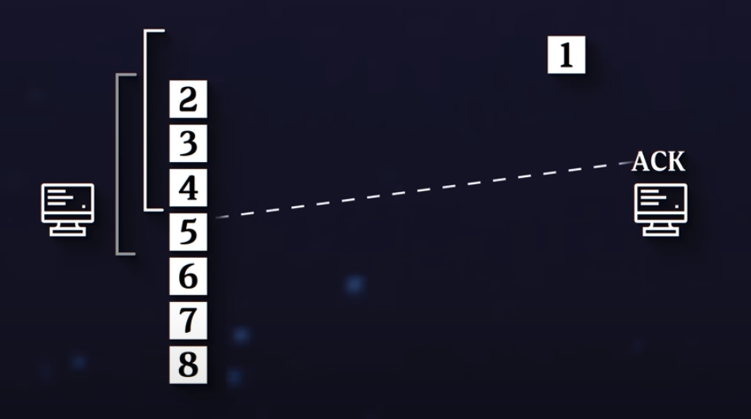

# Docs and notes

## What is protocol

- a design or a spec for one computer or device to communicate to another
- it describes how you break down the data, how exactly it is forumulated

## What is TCP

- a reliable, In-Order Packets
